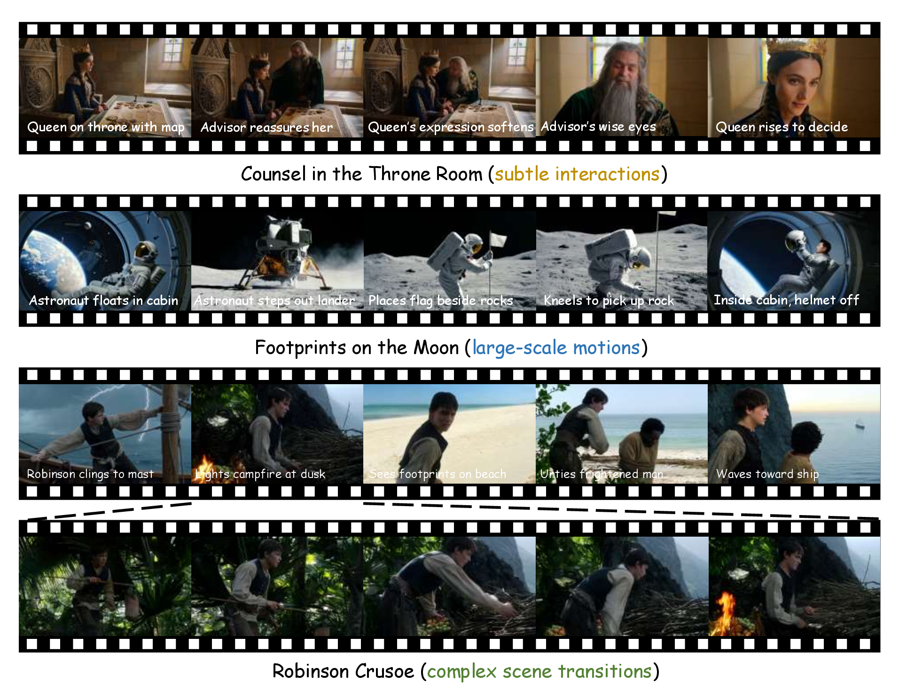

# Memento - Reconstruct to Remember for Consistent Long Video Generation

## Teaser

Memento generates long-form, multi-shot narrative videos with consistent subject identities across shots, scenes, and viewpoints. Given a global story caption and per-shot descriptions, Memento produces coherent minute-level videos through shot-by-shot autoregressive generation. See our 🌐 [Project Page](https://ernie-research.github.io/Memento/) for more details and video results.

[Open the teaser PDF](./teaser.pdf)

## TODO

- [ ] Weights Release
- [ ] Inference Code Release
- [ ] Training Release
